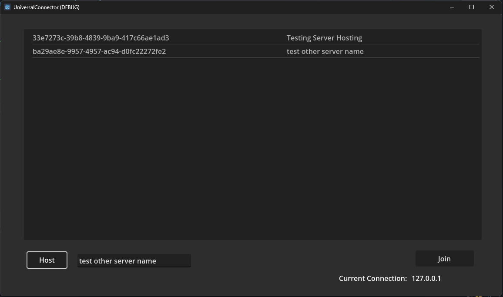

# UniversalHoster
A super simple DHCP-like application to facilitate server browsing in Godot (4.1.1) application (non-Mono and Mono compatible)

This tool came to me in a fever dream. It isn't done yet (but should work!)

Make sure to configure the IP addresses properly on the host and client.

This tool should not be used for production, just testing on secure networks.

Hoster-
The Hoster is a python TCP server that logs IP addresses and 'server names' associated with 'Host' commands, distributes host IPs on join request, and distributes the full server list of browse request. By default it deletes host logs that are older than 20 minutes.

Connector- C# (Mono) / GDScript
sends host, join, browse, and delete host commands to the hoster server. 
